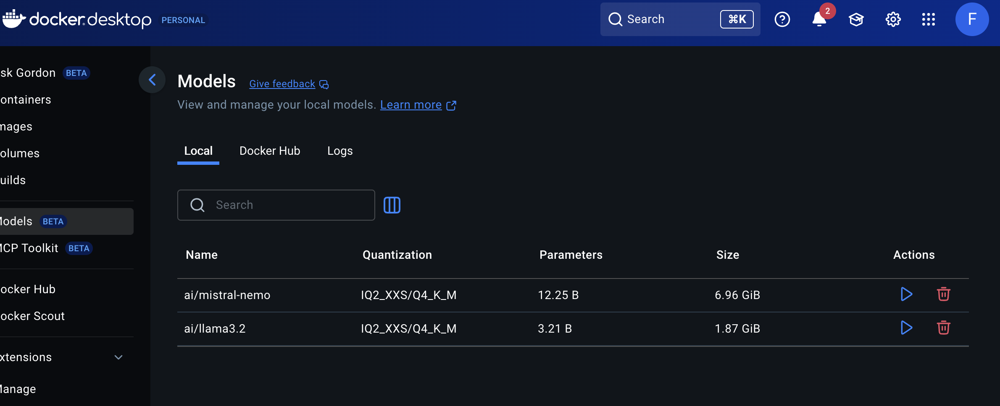
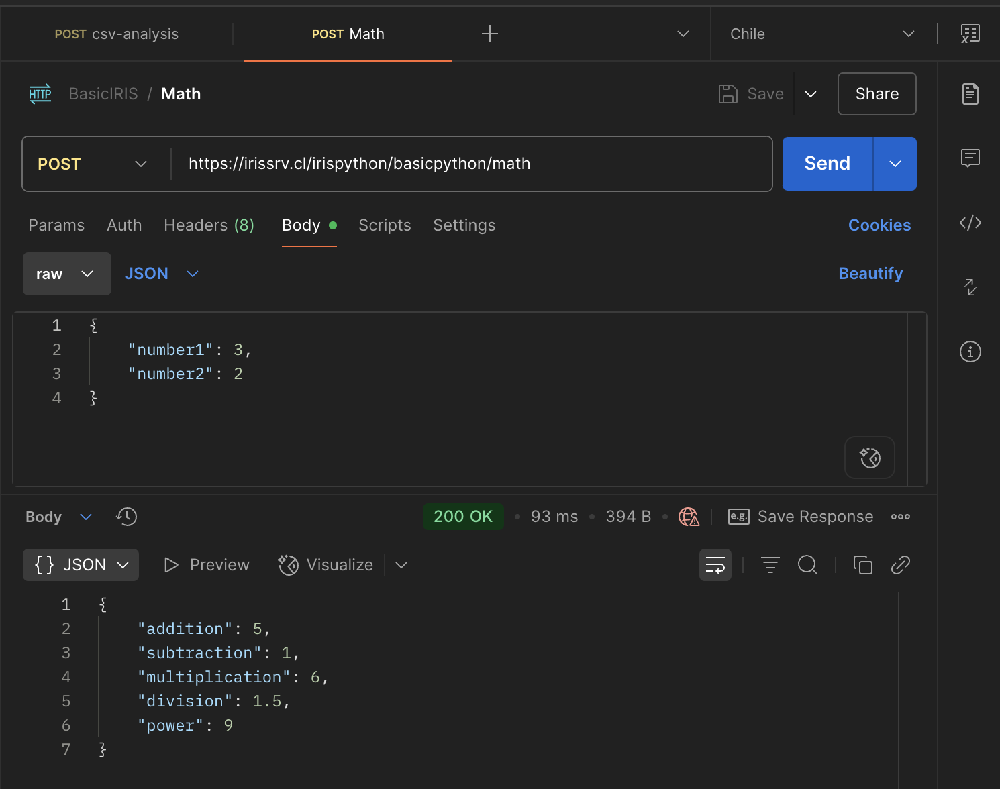
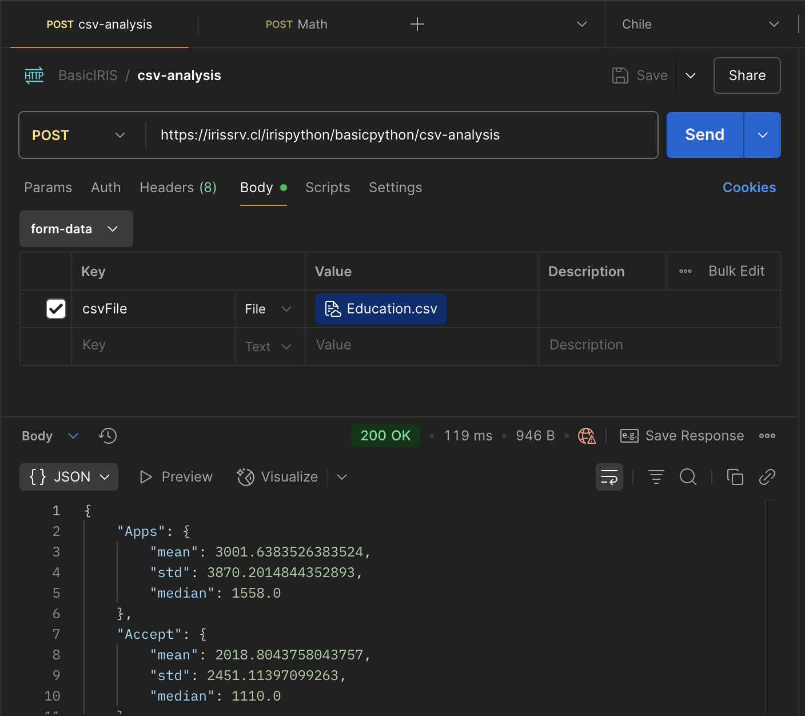
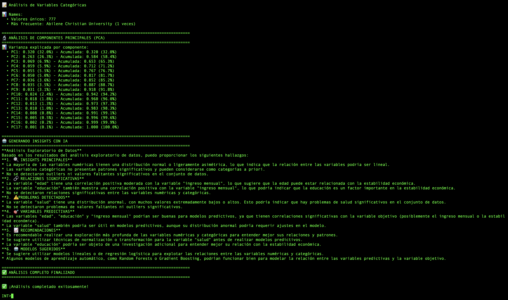

# Getting Started with InterSystems IRIS + Python: A Practical Intro with REST APIs and Embedded AI

Este proyecto está diseñado para quienes buscan aprovechar el "Embedded Python" de InterSystems IRIS y tener una idea de lo que pueden construir más allá del desarrollo clásico de clases o scripts. Aquí mostramos, paso a paso, cómo combinar ObjectScript y Python embebido dentro de una misma clase, construyendo APIs REST funcionales, simples y extendibles.


## Requisitos

- Docker + Docker Compose
- Docker Models + llama3.2
- Familiaridad básica con Python y APIs REST
- (Opcional) Conocimientos de InterSystems IRIS (pero no requeridos al inicio)





## Carga de Imagenes a usar

Aunque desde docker compose se pueden cargar las imágenes, puedes buscar otra versióny modificar los archivos respectivos.

El origen de las imagenes usadas en [InterSystems containers](https://containers.intersystems.com/contents)

### Webgateway 

- ARM

```bash
docker pull containers.intersystems.com/intersystems/webgateway-arm64:latest-preview
```

- amd64

```bash
docker pull containers.intersystems.com/intersystems/webgateway:latest-preview
```

#### Certificado SSL

Para tener un ambiente local pero con uso de https, podemos generar un certificado propio, así hacemos referencia al nombre de host como si lo hicieramos hacia uno en internet, y tenemos un escenario un poco más conocido, en lugar de usar "localhost"; me parece que eso hará tu proyecto transportable de una manera más rápida.

Vamos a usar como hostname y fqdn: irissrv.cl

Se puede generar certificado de forma automática o interactiva:

```bash
# Interactivo
openssl req -x509 -newkey rsa:4096 -keyout irissrv.key -out irissrv.crt -sha256 -days 365

# No-interactivo y 10 años de vigencia
openssl req -x509 -newkey rsa:4096 -keyout irissrv.key -out irissrv.crt -sha256 -days 3650 -nodes -subj "/C=CL/ST=Santiago/L=Santiago/O=Python Iris inc./OU=Innovation/CN=irissrv.cl"
```

Si lo ejecutas de manera no interactiva, puedes igualment validar la información generada:


Puedes ver Información del certificado:

```bash
openssl x509 -in irissrv.crt -text -noout
```

### Imagen para IRIS

Community, por costumbre uso IRIS 4 Health, que aunque no siempre uso los conectores HL7 o FHIR, pdoría usarlos eventualmente, entonces, los tengo a mano y no requiero levantar otra imagen o cambiar mi DockerFile

- ARM64

```bash
docker pull containers.intersystems.com/intersystems/irishealth-community-arm64:latest-preview
```

- AMD64

```bash
docker pull containers.intersystems.com/intersystems/irishealth-community:latest-preview
```


## Docker network

Sólo para tener comunicadas las imagenes, suelo usar una red común para algunos proyectos, que aunque se ejecuten de manera separada, pueden requerir comunicarse, ya sea por hostname o por IP. Por ello, previamente y para la ejecución del docker compose, es mejor ejecutar:

```bash
docker network create irisenv-net
```


## Estructura del proyecto

## Contenido

### 🔹 `DockerApi.cls`

Clase REST que expone 2 endpoints:

* /math:
	* Recibe un POST con dos variables numéricas.
	* Las pasa a un método Python embebido que:
   		* Calcula la suma, resta, multiplicación, división y potencia (A^B).
	* Devuelve los resultados como JSON.


	


* /csv-analysis:
	* Recive un arcvhio (csv).
	* Toma el archivo desde método en Objectscript
	* Pasa el archivo a método en Pyhton que
		* Realiza un análisis básico y retorna el resultado al método objectscript
	* Devuelve el análisis en JSON. 




### 🔹 `CSVAnalysis.cls`

Para ser ejecutada desde terminal; contiene sólo un método (Pyhton) para:
* Recibir un archivo CSV.
* Analizarlo con funciones básicas (análisis exploratorio).
* Analizarlo con ayuda de IA
	* Por defecto apuntará a Ollama, ubicado en port 11434 del host (docker); si se usa otro endpoint, actualizar la clase.

Ejemplo de uso:


```bash
Do ##class("BasicCRUD.CSVAnalysis").GetCSV("/home/irisowner/Education.csv")
```




---

## 🔧 Cómo iniciar

Puedes clonar el proyecto directamente:

```bash
git clone https://github.com/tu-usuario/iris-python-api.git
cd iris-python-api
docker-compose up --build
```

### Cargar el proyecto en INT

He incluido un instalador que creará una base de datos y un NameSpace "INT".

Además, creará la aplicación para que sea expuesta desde el mismo IRIS, y puedas accederla desde un navegador.

```bash
docker exec -it irispythons bash
iris session irispython < /home/irisowner/pasosiniciales.script
```

## Uso del Portal de gestión (SMP)

Para acceder al portal de gestión de IRIS, puede ser necesario agregar a tu archivo hosts la entrada para poder usar el nombre que le hemos dado al servidor web: irissrv.cl:

```bash
127.0.0.1	irissrv.cl
```

De esta forma puedes acceder [desde el navagador](https://irissrv.cl/irispython/csp/sys/UtilHome.csp)

User Name: superuser
Password: SYS

## POSTMAN

He incluido un proyecto en Postman para hacer uso de las API creadas.

## Siguientes pasos

Como siguientes pasos, puedo agregar la cración de una clase en IRIS, que permita dar a concoer cómo exponer APIs que permitan operaciones CRUD sobre estas mismas, con una interfaz además del proyecto Postman.


# 🔍 ¿Por qué usar IRIS?

A diferencia de simples microservicios con FastAPI o Flask:

•	IRIS permite centralizar lógica y monitoreo.
•	Puedes delegar tareas complejas a Business Services y Processes.
•	Puedes mantener una visión clara de cómo fluyen los datos en tiempo real.
•	Y sí, puedes usar Python sin perder el potencial de IRIS como plataforma.


# 📬 Comentarios

Este proyecto nace de la necesidad de mostrar que IRIS no es sólo para expertos ObjectScript ni para sistemas hospitalarios enormes. También es una excelente herramienta para construir APIs modernas, rápidas y trazables.

